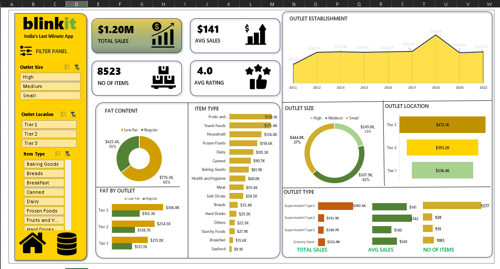

# Blinkit Sales Analysis Dashboard

## Project Overview

This project analyzes Blinkit grocery sales data using Microsoft Excel. The dashboard provides insights into sales performance, outlet characteristics, and product categories through interactive visualizations and filters.

## Objectives

* Analyze overall sales performance.
* Identify top-performing outlet types and locations.
* Compare sales across item categories.
* Understand the impact of outlet size and fat content on sales.

## Tools Used

* Microsoft Excel
* Pivot Tables
* Pivot Charts
* Slicers
* Data Cleaning & Analysis

## Key Performance Indicators (KPIs)

* Total Sales: $1.20M
* Average Sales: $141
* Number of Items: 8,523
* Average Rating: 4.0

## Dashboard Features

* Sales by Outlet Establishment Year
* Sales by Outlet Size
* Sales by Outlet Location
* Sales by Item Type
* Fat Content Analysis
* Interactive Filters using Slicers

## Key Insights

* Tier 3 outlets generated the highest sales.
* Fruits & Vegetables and Snack Foods were among the top-selling categories.
* Regular-fat products contributed more sales than low-fat products.
* Medium-sized outlets showed strong overall performance.

## Dashboard Preview

## Project Files

* BlinkIT_Grocery_Data_Analysis.xlsx
* blinkit_data.csv
* dashboard.png

## Author

Supriya Singh
Aspiring Data Analyst
